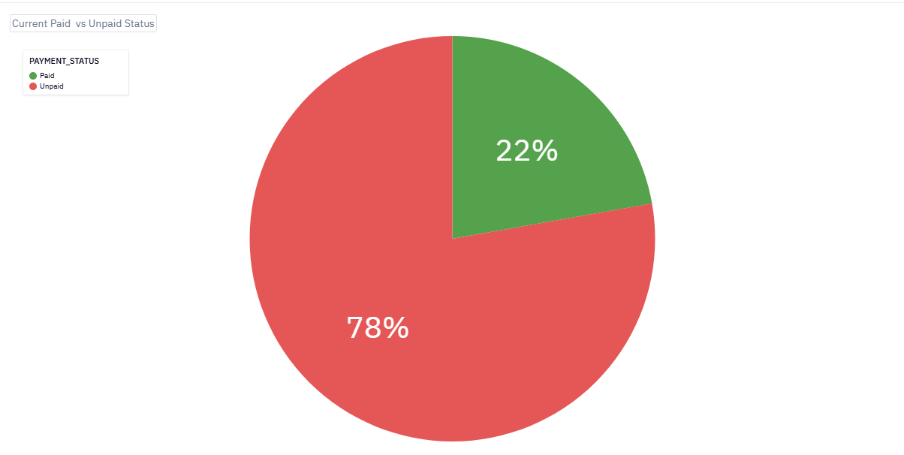
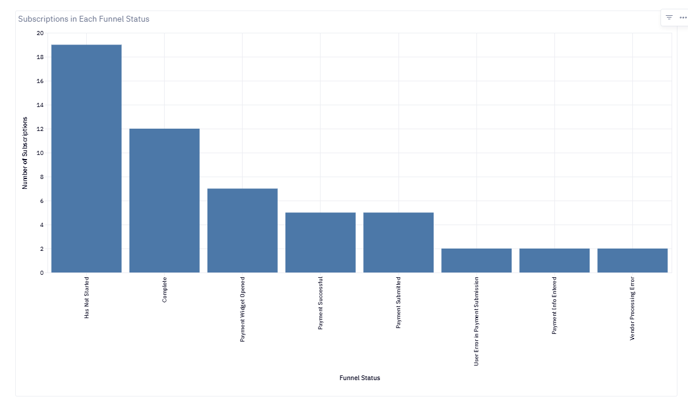
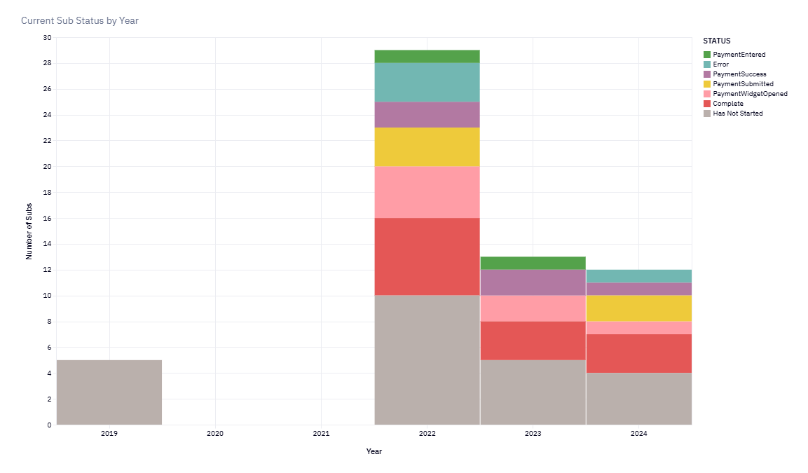
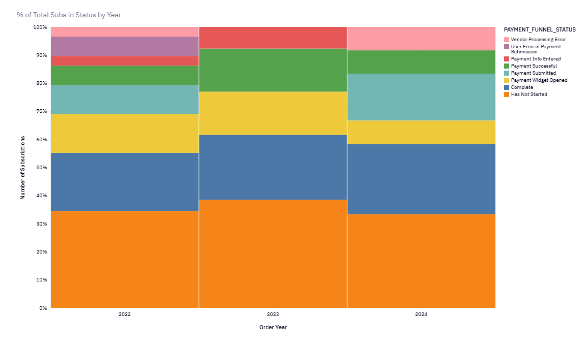
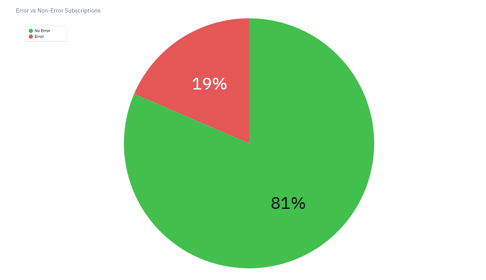
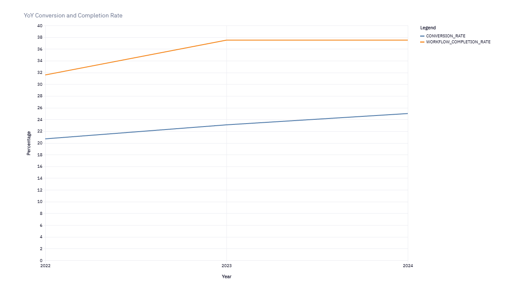
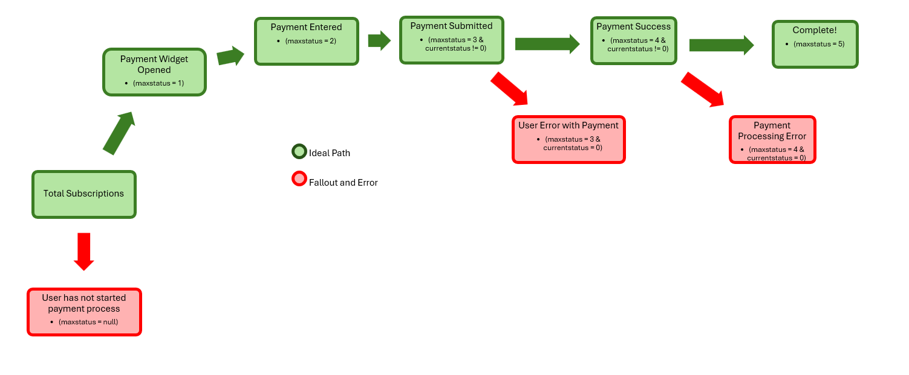
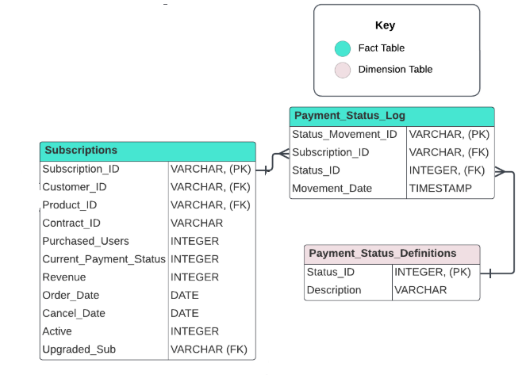

# SaaS Payment Funnel Analysis

## Executive Summary
This project analyzed a SaaS subscription payment funnel to determine why 78% of subscriptions remain unpaid. I identified three primary friction points across the payment journey and provided actionable recommendations to improve the overall conversion rate of 22%.

1) Mapped each subscriber to their current stage in the payment funnel
2) Identified user and vendor errors causing drop-offs
3) Recommended process optimizations to boost conversions

---

### Business Problem
The finance team identified a significant volume of unpaid subscriptions and engaged the analytics team to diagnose potential friction points within the online payment portal. The objective was to locate where subscribers were abandoning the payment journey and to recommend specific interventions to improve the conversion rate.

---

### Approach
1) **Data Generation & Preparation:** A synthetic dataset was generated using ChatGPT and loaded into a Snowflake data warehouse. During initial exploration, five subscriptions from 2019 were identified as test accounts predating the product's actual launch in 2022 and were excluded from all subsequent analysis.
2) **Exploratory Data Analysis:** Used SQL (including multi-table joins and CTEs) to explore the dataset structure, validate data integrity, and map the distinct paths a subscriber could take through the payment funnel.
3) **Funnel Classification & Analysis:** Used CASE statements, Views, and Subqueries to assign each subscription a precise payment funnel status based on recorded events. Analyzed funnel stage volumes by year (absolute and as a percentage of total), conversion rates, workflow completion rates, and error rates.
4) **Data Visualization:** Visualized findings in Hex Notebook using pie, stacked column, and line charts to communicate current state and year-over-year trends.

---

### Skills
- SQL (CTEs, Joins, CASE statements, Views, Subqueries)
- Data visualization
- Data wrangling and cleaning
- Data science notebooks (Hex)
- Snowflake Data Warehouse

---

### Results & Business Recommendations

| Metric | Value |
|---|---|
| Overall Conversion Rate | 22% |
| Workflow Completion Rate | 34% |
| Error Rate in Buy Flow | 19% |
| Never Started Payment | 35% |

**1) Friction Points:** The largest group of unpaid subscribers (35%) never initiated the payment process at all, indicating a systemic engagement issue. The second-largest drop-off (13%) consists of subscribers who opened the payment widget but exited before entering payment information.

**2) Error Analysis:** Approximately 19% of subscribers encountered an error during the payment process, categorized as either user-generated (incorrect payment information) or vendor-side (third-party payment processor failures).

**3) Recommendations:** Implement automated payment reminders targeting the "Has Not Started" segment; add one-click payment options (Apple Pay, Google Pay) to reduce manual entry friction; consult with the third-party payment processor to investigate and mitigate vendor-side errors.

**4) Business Impact:** Addressing the top-of-funnel drop-off alone represents the single largest conversion opportunity. Both conversion rate and workflow completion rate showed marginal year-over-year improvement across 2022–2024, and targeted interventions could accelerate that trend significantly.

---

### Next Steps
1) **Outreach:** Design and launch an automated payment reminder sequence targeting the "Has Not Started" segment within the next sprint cycle.
2) **Payment UX:** Evaluate and pilot Apple Pay / Google Pay integration; assess implementation timeline and cost with the engineering team.
3) **Vendor Review:** Schedule a review meeting with the third-party payment processor to share error rate data and agree on a remediation roadmap.
4) **Measurement:** Build a live conversion rate dashboard to replace ad hoc reporting and enable real-time monitoring of funnel health.
5) **Limitations:** The dataset is intentionally small, which limits the statistical power of trend analysis. Further data collection and more granular event tracking would provide deeper insights.

👉 [View the full project write-up on Notion](https://charming-heat-ae5.notion.site/SaaS-Payment-Funnel-Analysis-770b743fecb883d1a15d813abfadbe77)
---

### Payment Funnel Map

---

### Entity-Relationship Diagram

